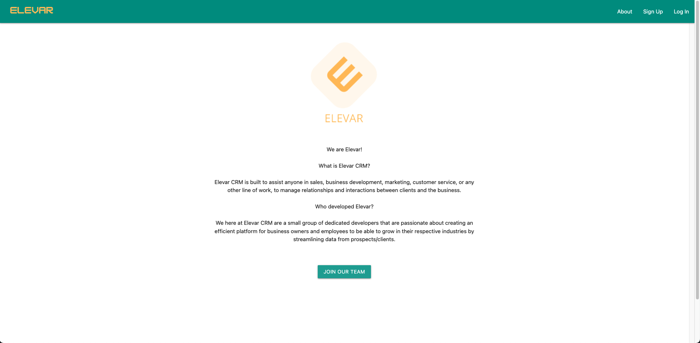

# Elevar CRM

### Summary
| Field   |      Detail      |  
| -------- | :-----------: | 
| Project Name | Elevar CRM  | 
| Description |   Customer Relationship Management    | 
| Developers | Kyle Canamar, Sunghun Park, Nathan Yi |
| Live Website | [Live Site](https://elevarcrm.herokuapp.com)|
| Repo | [GitHub](https://github.com/SunghunP/elevar_crm/tree/dev)|
| Miro | [Miro Board](https://miro.com/app/board/uXjVOkpg5tU=/) |

### Technologies Used
    Python, Django, PostgreSQL, AWS, Materialize, Django-Phonenumbers, Environ

### User Stories
- AAU I want to be able to create an account
- AAU I want to have multiple accounts linked to my user.

- AAU I want to be able to see all of my accounts in one place

-  AAU if I "open" one of the accounts I want to be able to see the most recent transations

- AAU when I "open" one of my accounts I want to be able to see all of the contacts within the account or click on something to see all of it

- AAU when I "open" one of my accounts I want to be able to see all of the transaction or click something to see all of them

- AAU I want to be able to create a new transaction

- AAU I want the transactions to be automatically sorted by date

- AAU I want to be shown a graph that shows the most products sold to the account like a bar graph or a circle graph.?

- AAU I want to be able to login or log out

- AAU I don't want any unauthorized access to my accounts

- AAU I want to be able to store my data in the cloud

- AAU i should not be able to see anything/do anything if i am not logged in.

### Wireframes
Sign Up Page

Dashboard

Contacts

About

### Live Site
Landing Page

Signup Page

Contact List

About

